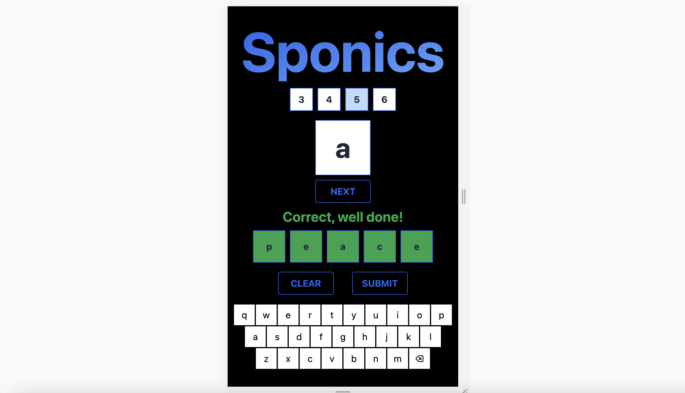
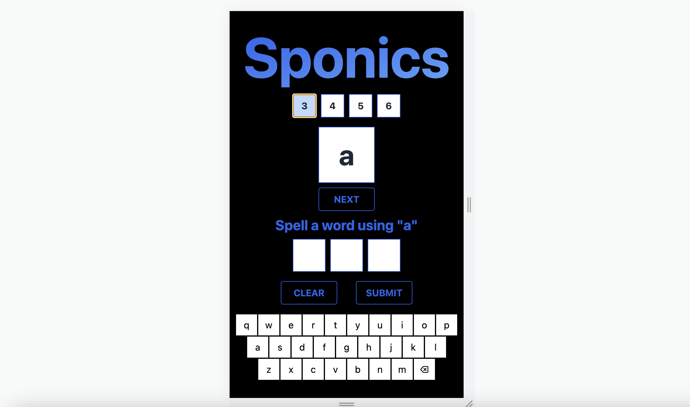

# Sponics

Created a web application using Next.js, React.js, Tailwind CSS, and MobX. This is aimed at young children learning to spell using phonics.

## Link to app

The app has been hosted on vercel at the below link:

[https://sponics.vercel.app](https://sponics.vercel.app/)

## Approach

- **Store:** used a store to hold the whole state tree of application. This is tested in e2e tests but opportunity to unit test this separately.

- **Brad Frost’s Atomic Design principle:** created a series of standalone and portable components that I have been able to reuse within different elements of the app.

- **TDD, OOP and DRY:** following a Test Driven Development method, Object Oriented Programming and do not repeat yourself approach to write clean, maintainable and efficient code.

- **Version Control:** using Git branching to work on the individual tickets, pushing to main on complication.

## Current Progress





### User Stories

- User can select word length
- User can select random phonics sound that must be used in guess
- User can type guess and backspace using machine keyboard
- User can submit guess
- User can see a selection of submit messages for correctly spelt word, incorrectly spelt word, if word is too short and if word does not include sound
- User can use clear button to clear guess
- User can use on screen Qwerty keyboard to click guess
- User can see component change colour to red and green based on incorrect or correct guesses

### Screen shots

# Set-up and Testing

## Installation

To download and initialise the project:

```js
$ git clone https://github.com/ChrisHutchinson1982/sponics
$ cd sponics
$ npm install
```

## Using the App

Start running the dev server:

```js
$ npm run dev
```

Open http://localhost:3000 to view and use the Sponics app in your browser.

## Testing the App

From the main project directory...

```js
$ npm run test
```

**Important:** Ensure you are running the dev servers before running the tests.

# Technologies

Here's an overview of the technologies used to build the application.

- Next.js to enable server-side rendering and automatic code splitting
- MobX and Mobx-react-lite to manage state.
- Cypress for end-to-end testing and component testing, on the front-end.
- Prettier for code formatting.
- Tailwind for styling.
- Vercel for hosting

# Next steps

- Additional features to enhance game play (i.e. points total, timer etc.)
- Play around with styling to appeal to children
- Add animation
